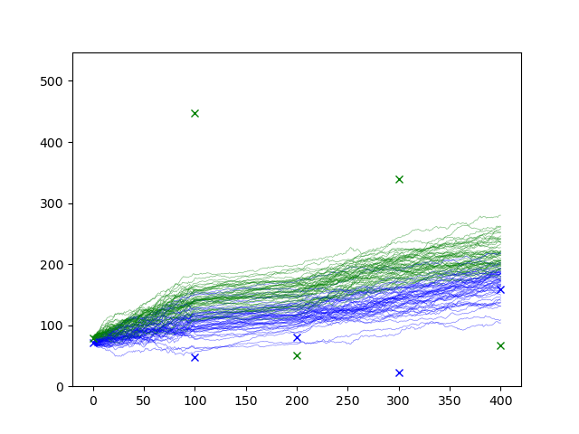

## Black-Box Variational Inference for Stochastic Differential Equations


Tensorflow implementation of the Lotka-Volterra example detailed in [Black-box Variational Inference for Stochastic Differential Equations](https://arxiv.org/abs/1802.03335) (ICML, 2018), by [Tom Ryder](https://scholar.google.com/citations?user=_qL2UDkAAAAJ&hl=en), [Andy Golightly](http://www.mas.ncl.ac.uk/~nag48/), [Stephen McGough](http://www.ncl.ac.uk/computing/people/profile/stephenmcgough.html#background) and [Dennis Prangle](http://www.ncl.ac.uk/maths-physics/staff/profile/dennisprangle.html#background).

 ---

### Example: Lotka-volterra

Here we demonstrate the implementation of example "multiple observation times with unknown parameters" in section 5.1 of the paper. That is, full parameter inference for a two-dimensional Lotka-Volterra SDE, with known variance of the measurement error, observed a discrete time-steps of 10.

#### System Requirments

The following example was tested using tensorflow 1.5, numpy 1.14 and python 3. It has not been rigorously tested on newer and/or later versions of any of the dependencies. For any related questions, please see the contact section.

This example additionally makes use of tensorboard (1.5) to visualise the training. As such, you should specify the path for your tensorboard output in *lotka_volterra_data.py*. For example:

```python
PATH_TO_TENSORBOARD_OUTPUT = "~/Documents/my_cool_model/train/"
```
and then launch tensorboard using:
```
tensorboard --logdir=~/Documents/my_cool_model/train/
```

Note that the parameter posteriors in tensorboard are parameterised using log-normals.

#### System Requirments - PyTorch

`lotka-volterra-torch` was tested using PyTorch 1.10.0, numpy 1.21.3, pyro 1.7.0 and python 3.9.7. 

#### Running the Example
This example assumes a known, constant known variance of the measurement error (you can change the value in the data file, i.e. 'TAU') and attempts to learn:

- The latent diffusion process.
- The parameters in the description of the SDE.

After entering the observations, observation times, the discretization, variance of the measurement error and and specifying the dimensions of the network (i.e. the number of layers and the number of nodes in each of those layers) *lotka_volterra_data.py*, we can then run the experiment using:

```
python VI_for_SDEs.py
```

Note that the model will infrequently produce an error relating to the Cholesky decomposition used in *VI_for_SDEs.py*. This typically happens early in training when the network has a tendency to produce ill-conditioned matrices leading to numerical instability. Should it, however, become a persistent issue (under the current settings it should not), you should increase the value of "eps_identity" in the function "rnn_cell" of *VI_for_SDEs.py*.

#### Visualisation
By saving the paths produced in training (not something the model will presently do by default), we can watch the model learn the latent diffusion process:

* Using TF 1.5:


* Using PyTorch 1.10.0:
  



---

### Contact

Should you have any queries or suggestions (all welcome), you should contact either:

- [t.ryder2@ncl.ac.uk](mailto:t.ryder2@ncl.ac.uk)

- [dennis.prangle@ncl.ac.uk](mailto:dennis.prangle@ncl.ac.uk)

For torch version, 

- [lkw1718@snu.ac.kr](lkw1718@snu.ac.kr)